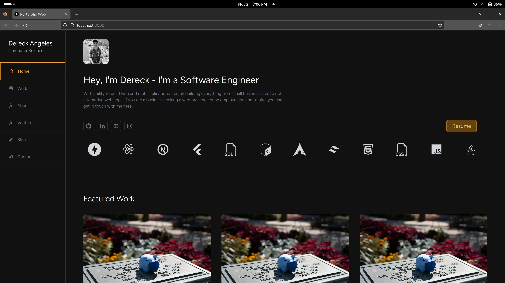

## :fountain_pen: Portafolio

- This project is a personal project. It is a testament to my skills and competencies as a web developer. It was built using cutting-edge technologies such as NextJS, TailwindCSS and Typescript, demonstrating my proficiency in these tools and my ability to keep up with current trends in web development. The main goal of this project was to put into practice and demonstrate a variety of technical skills. Among them, Server Side Rendering (SSR), Search Engine Optimization (SEO) and Responsive Design.

- In addition, this project was intended to replace my old portfolio, which was developed with ReactJS. While ReactJS is a powerful tool in its own right, the decision to migrate to NextJS for this project represents my commitment to continuous improvement and adaptability, two essential qualities for any successful web developer. In short, this project is not only a showcase of my technical skills, but also a representation of my passion for web development and my commitment to excellence in my work. I'm excited to share it with the world and hope it serves as an inspiring example for other emerging developers.



## My Role

:hammer_and_wrench: responsabilities

- To look for a clean and attractive professional design to the public.
- Constantly update the information it contains.
- To project the information in a concise and easy to digest way.
- Optimization of the page (SEO).

:satellite_antenna: Technologies


This is a [Next.js](https://nextjs.org/) project bootstrapped with [`create-next-app`](https://github.com/vercel/next.js/tree/canary/packages/create-next-app).

## Getting Started

First, run the development server:

```bash
npm run dev
# or
yarn dev
# or
pnpm dev
# or
bun dev
```

Open [http://localhost:3000](http://localhost:3000) with your browser to see the result.

You can start editing the page by modifying `app/page.tsx`. The page auto-updates as you edit the file.

This project uses [`next/font`](https://nextjs.org/docs/basic-features/font-optimization) to automatically optimize and load Inter, a custom Google Font.

## Learn More

To learn more about Next.js, take a look at the following resources:

- [Next.js Documentation](https://nextjs.org/docs) - learn about Next.js features and API.
- [Learn Next.js](https://nextjs.org/learn) - an interactive Next.js tutorial.

You can check out [the Next.js GitHub repository](https://github.com/vercel/next.js/) - your feedback and contributions are welcome!

## Deploy on Vercel

The easiest way to deploy your Next.js app is to use the [Vercel Platform](https://vercel.com/new?utm_medium=default-template&filter=next.js&utm_source=create-next-app&utm_campaign=create-next-app-readme) from the creators of Next.js.

Check out our [Next.js deployment documentation](https://nextjs.org/docs/deployment) for more details.
